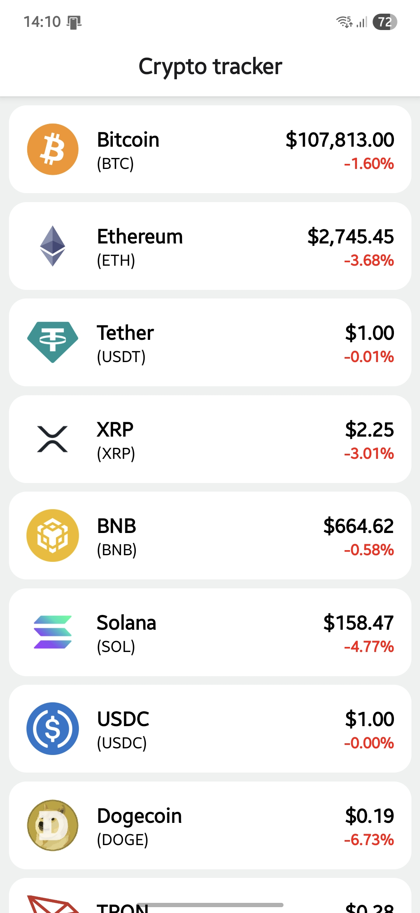
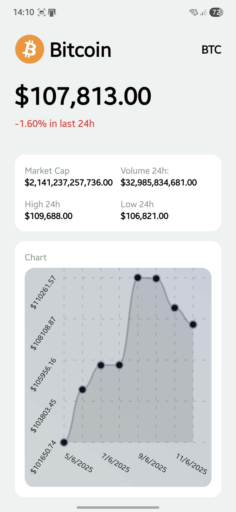

# 📈 Crypto Price Tracker

A beautiful and mobile-friendly **React Native** application that displays real-time cryptocurrency prices with charts and details. Built using **CoinGecko API**, **axios**, and **react-native-chart-kit**, this app provides a clean interface for tracking top coins like BTC, ETH, and more.



---

## 🚀 Features

- 🔄 Live price updates from [CoinGecko](https://www.coingecko.com/en/api)
- 📊 Interactive charts for price trends (7D)
- 📱 Beautiful and responsive UI with themed coin detail screens
- 🔍 View detailed information: current price, market cap, volume, price change %, etc.

---

## 📸 Screenshots

| Home | Coin Details |
|------|--------------|
|  |  |

---

## 🧱 Tech Stack

- **React Native** (with Expo)
- **TypeScript**
- **axios** (for API requests)
- **react-native-chart-kit** (for chart rendering)
- **expo-router** (for screen navigation)
- **CoinGecko API** (for real-time market data)

---

## 🧪 Installation

```bash
git clone https://github.com/AngelC1099/crypto-price-tracker.git
cd crypto-price-tracker
npm install
npx expo start
